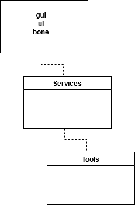
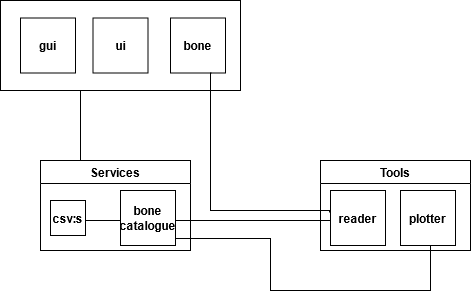
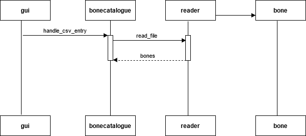
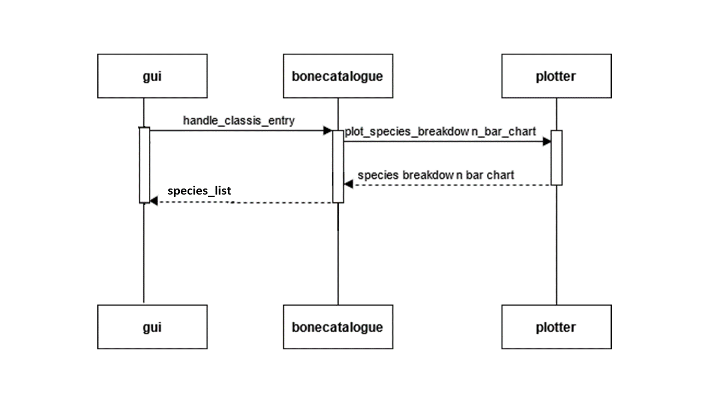

# Arkkitehtuurikuvaus

## Pakkausrakenne

Koodin pakkausrakenne on esitetty seuraavassa kaaviossa. Käyttöliittymät ja luokka ohjelman käsittelemiä olioita varten on suoraan src-kansiossa. Services-pakkaus sisältää sovelluslogiikan ja ohjelman kokeilemiseen sopivia csv-tiedostoja. Tools-pakkauksessa sijaitsevat sovelluslogiikan käyttämät työkalut.

## Sovelluksen rakenne

Sovelluksella on toimivat tekstikäyttöliittymä Textinterface ja graafinen käyttöliittymä Gui. Käyttöliittymiä palvelee sovelluslogiikka Bonecatalogue. Aluksi sovelluslogiikka lukee csv-tiedoston listaksi Bone-luokan olioita Reader-lukijalla. Tämän jälkeen sovelluslogiikan metodeilla voidaan suorittaa aineistosta laskentaa ja tuottaa graafeja, jotka sovelluslogiikka tekee Plotter-työkalun avulla.

## Sekvenssikaaviot

Sovelluksen käytön alussa tapahtuva csv-tiedoston lukeminen Bone-oliolistaksi:

Sovelluksen toiminta esimerkkimetodin avulla kuvattuna:

Käyttöliittymästä valitaan haluttu vaihtoehto. Graafisen käyttöliittymän painikkeen painaminen kutsuu sovelluslogiikan Bonecatalogue metodia, joista osa toimii ilman parametriä, ja osalle annetaan parametri. Sovelluslogiikka tekee tarvittavan toiminnon ja kutsuu tarvittaessa Plotter-työkalua tekemään kaavion taulukosta tai sanakirjasta, jonka sovelluslogiikka antaa sille parametrinä. Graafit ja mahdollinen tulostus palvelee osteologisen raportin tarpeita. Raporteille on tyypillistä, että kaaviota tuetaan tai kommentoidaan tekstissä, minkä vuoksi on kätevää graafin ohella tulostaa tiettyjä tuloksia. Kaikki sovelluslogiikan laskentametodit toimivat samalla logiikalla, mutta osan ei ole tarpeellista tuottaa graafeja.

## Kehitettävää

Käyttöliittymät voidaan tulevaisuudessa sijoittaa omaan ui-pakkaukseen. Kysymykseksi jää, mihin hierarkkisesti korkein olioluokka Bone on sijoitettava. Periaatteessa graafinen käyttöliitymä tässä muodossaan on jossain määrin tarpeeton ja sovellus voisi myös toimia niin, että se tuottaa kaiken raporttiin tarvittavan informaation "nappia painamalla".
