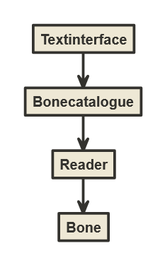

# Arkkitehtuurikuvaus

## Pakkausrakenne

Kuvassa esitetään tavoitteena oleva pakkausrakenne, jossa ui sisältää sekä tekstikäyttöliitymän että graafisen käyttöliittymän. Application-pakkaus sisältää sovelluslogiikan ja sen käyttämän luokan. Repositories-pakkaukseen tulee pysyväistallennus. Tällä hetkellä sovelluslogiikka, luokka ja käyttöliittymä ovat vielä src-kansiossa.

## Sovelluksen rakenne

Tällä hetkellä sovellus koostuu tekstikäyttöliittymästä Textinterface, jota palvelee sovelluslogiikka Bonecatalogue. Sovelluslogiikka käyttää tiedoston käsittelemiseen omia metodejaan ja Reader-lukijaa, joka lukee csv-tiedoston listaksi Bone-luokan olioita.

## Sekvenssikaaviot csv-tiedoston lukemisesta ja esimerkkimetodista

![sekvenssikaaviot] (.kuvat/sekv.jpg)
