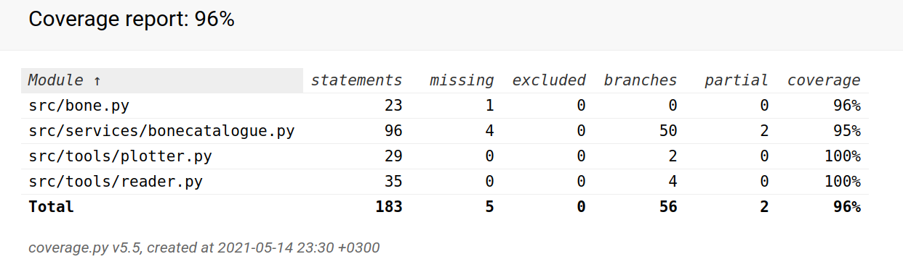

# Testausdokumentti

## Sovelluslogiikka

Sovelluslogiikasta vastaavaa Bonecatalogue-luokkaa testataan [TestBonecatalogue](https://github.com/mojord/ot-harjoitustyo/blob/master/src/tests/bonecatalogue_test.py)-testiluokalla. Testaus alustetaan lukemalla testitiedosto barts2.csv testidataksi.

### Testauskattavuus

Sovelluksen testauksen haarautumakattavuus on 96 %, kun käyttöliittymät on jätetty testauksen ulkopuolelle.

## Järjestelmätestaus

Järjestelmätestaus suoritettiin manuaalisesti. Sovellus asennettiin ohjeen mukaan Linux-ympäristössä ja kokeiltiin mukaan liitetyillä tiedostoilla. Myös virheellisiä syötteitä kokeiltiin. Virheellisen tiedostonimen syöttämisestä annetaan mielekäs virheilmoitus.

## Parannettavaa

Osa sovelluksen metodeista sekä tulostaa että palauttaa tietoja. Joidenkine metodien palautus palvelee myöhemmin lisättäviä kuvaajatoimintoja, mutta ei tällä hetkellä anna mitään käyttäjälle.
